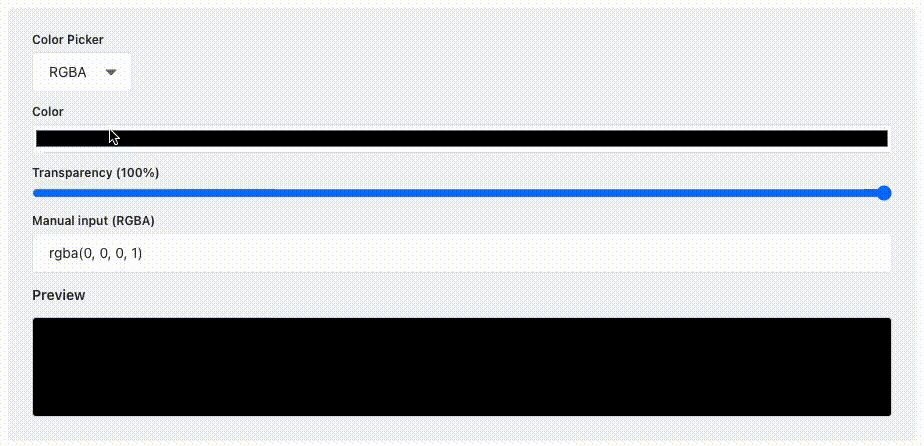

# RGBA Color Picker Plugin for Strapi

<p align="center">
  
</p>

> A custom field plugin for [Strapi v5](https://strapi.io) that allows color selection using RGBA, RGB, HEX, HSL, and HSLA formats, with live preview and transparency control.

---

## 📦 Installation

```bash
npm install strapi-rgba-color-picker
```

Then enable it in your `/strapi/config/plugins.ts`:

```ts
export default {
  plugins: {
    'rgba-color-picker': {
      enabled: true,
    },
  },
};
```

If you're installing directly in a `src/plugins` folder instead, copy the plugin manually and skip the `npm install` step.

---

## ✨ Features

- 🎨 Pick colors using multiple formats: `hex`, `rgb`, `rgba`, `hsl`, `hsla`
- 🖱️ Built-in color input with preview
- ✍️ Manual value input with real-time validation
- 🔠 Format selector (with persistence)
- 🌍 Internationalization support (English and Portuguese 🇺🇸 🇧🇷)

---

## 🧩 Usage

1. Go to the **Content-type Builder** in your Strapi Admin.
2. Create or edit a collection type.
3. Add a new **Custom Field** and choose **RGBA Color Picker**.
4. Select your default format (optional).
5. Save and use the color picker in your entries!

---

## 🌐 Translations (i18n)

The plugin is fully translatable. Included locales:

- `en` (English)
- `pt-BR` (Português Brasil)

If you'd like to contribute with other languages, feel free to open a PR!

---

## 🧪 Development & Contributing

To develop locally:

```bash
# Link the plugin to your Strapi project manually:
# Inside your Strapi app root
cd src/plugins
git clone https://github.com/thiagotnon/strapi-rgba-color-picker.git

# Or use `npm link` for local testing
```

To contribute:

1. Fork the repo
2. Make your changes
3. Submit a PR ❤️

---

## 📄 License

MIT © [RGBA Color Picker Plugin for Strapi](https://github.com/thiagotnon/strapi-rgba-color-picker)

---

## 📚 Related

- [Strapi Plugin Documentation](https://docs.strapi.io/dev-docs/plugin-development)
- [Strapi Design System](https://design-system.strapi.io/)
